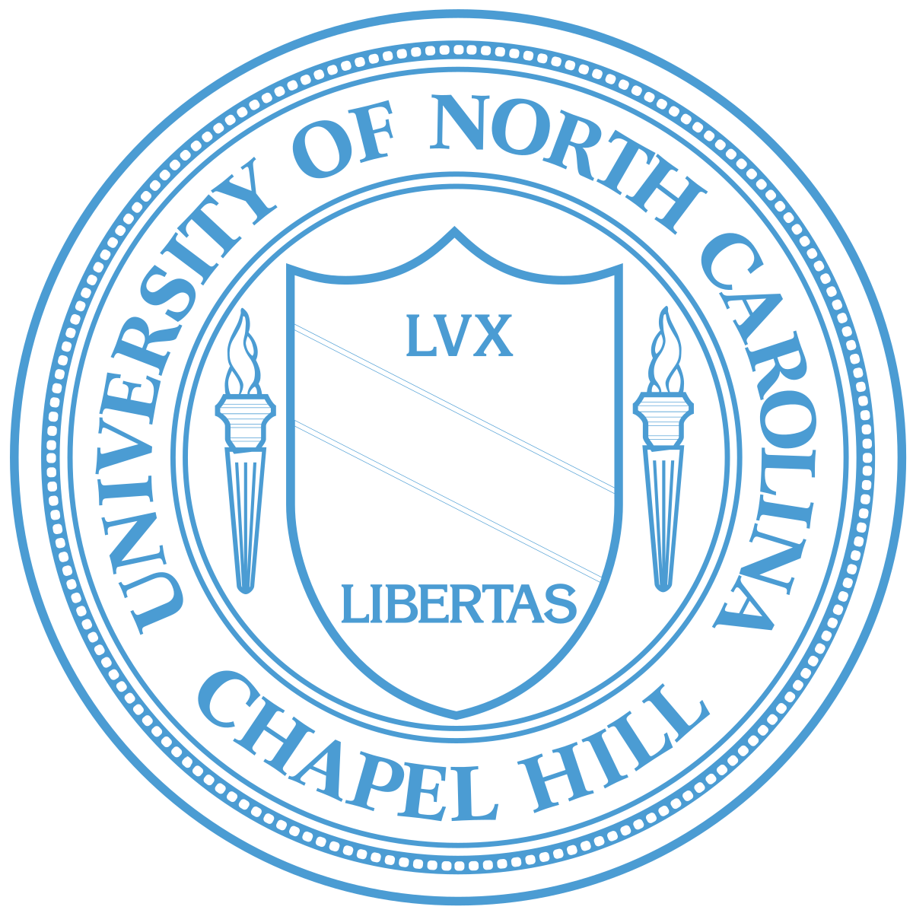
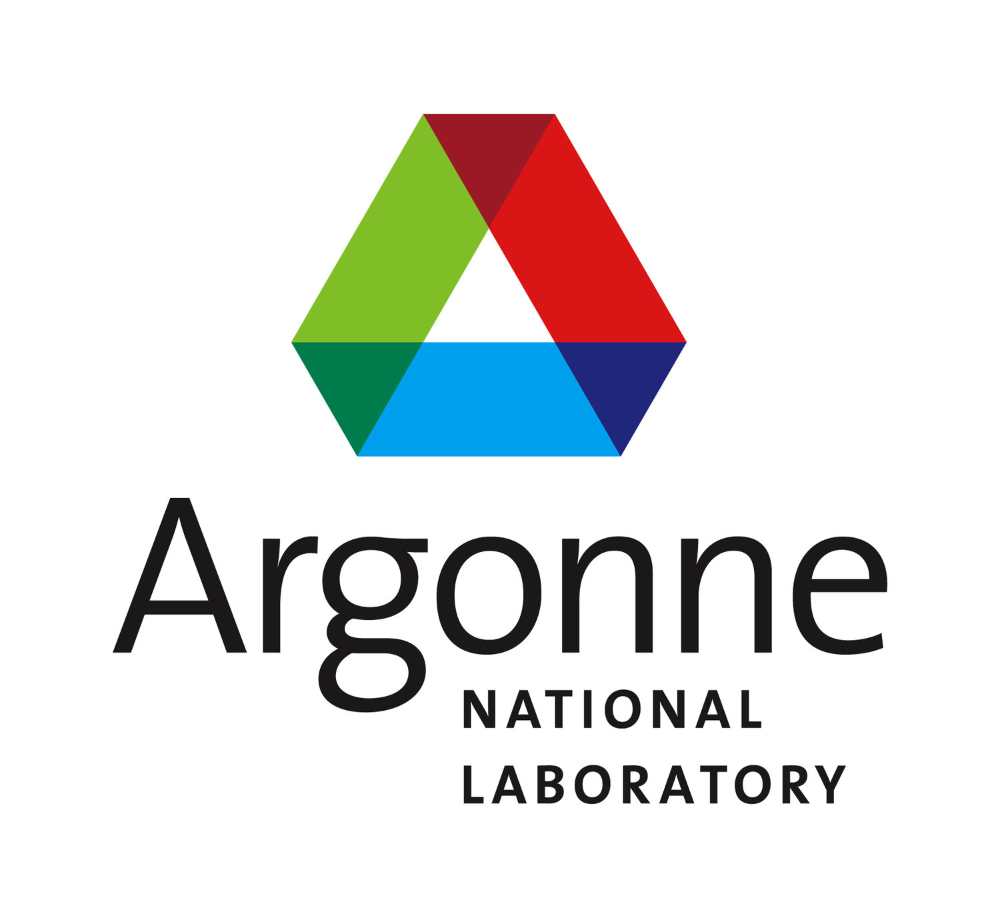

You can find a pdf version of my CV [here](https://nathanielpritchard.github.io/files/pritchard_cv.pdf).
# Education

{: style="float: left" height="100px" width="150px"} 
**University of Wisconsin-Madison** 
PhD Student Department of Statistics 
*2018 - 2024* 
  Since 2018 I have been at the University of Wisconsin at Madison in the Statistics Department. During this time, I have worked under the advisement of Professor Vivak Patel on progress tracking for iterative randomized solvers with applications in solving generalized linear models.
 
{: style="float: left" height="100px" width="100px"} 
&nbsp;&nbsp;&nbsp;**University of North Carolina at Chapel Hill** 
&nbsp;&nbsp;&nbsp;Major Statistics and Analytics and Economics 
&nbsp;&nbsp;&nbsp;*2014 - 2018* 
 In undergrad I majored in Statistics and Analytics as well as Economics with minor in Spanish. For research, I  worked under the advisement of Professor Shankar Bhamidi and Professor Nikhil Kaza on using network community detection techniques to identify metropolitan areas from commuter data.
 
# Research
{: style="float: left" height="80px" width="80px"} 
&nbsp;&nbsp;&nbsp;**Argonne National Laboratory** 
&nbsp;&nbsp;&nbsp;Givens Associate 
&nbsp;&nbsp;&nbsp;*Summer 2020* 
  In the summer of 2020 I worked with Dr. Adrian Maldonado to investigate the effectiveness of different preconditioners to for solving Graph Laplacians arising from power grid problems. 
 
{: style="float: left" height="80px" width="80px"} 
&nbsp;&nbsp;&nbsp;**Argonne National Laboratory** 
&nbsp;&nbsp;&nbsp;Givens Associate 
&nbsp;&nbsp;&nbsp;*Summer 2023* 
  In the summer of 2023 I worked with Dr. Adrian Maldonado on using deflation methods on GPUs and putting together a library of preconditioners on Julia for use in conjunction with any of the iterative solver packages in Julia. 
 
# Awards and Honors
**SIAM Student Travel Award (SIAM LA24)** 
2024 
**Outstanding TA Award** 
2023 
**Student Research Grant Competition University of Wisconsin - Madison** 
2023 
**Outstanding TA Award (Honorable Mention)** 
2022 
# Skills 
**Programming Languages:** Julia, C, R, Python, Unix, CUDA, OPENMP, MPI, Petsc 
**Languages:** Spanish 

